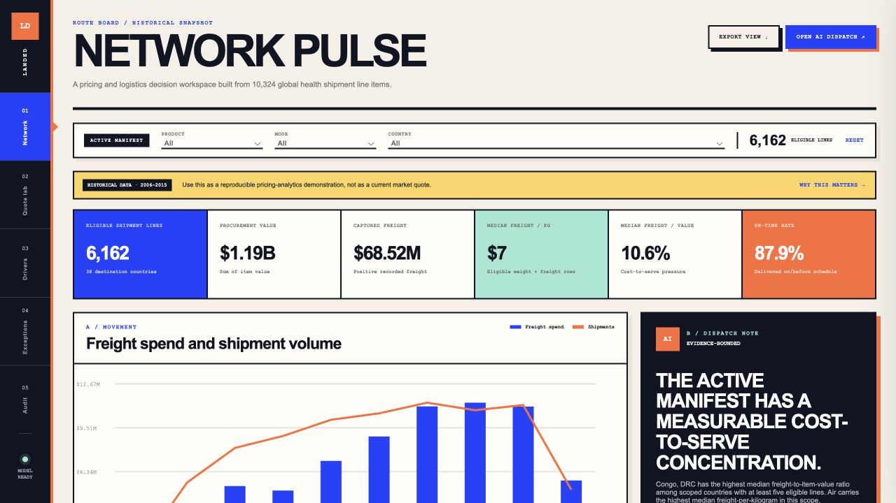

# Landed — ARV Supply Chain Pricing Intelligence

An end-to-end supply-chain pricing portfolio project that turns a 10,324-line historical shipment dataset into governed cost metrics, peer-lane quote ranges, anomaly investigations, an evaluated freight-cost model, and evidence-bounded AI explanations.



> All records are historical. This project demonstrates analytical workflow and decision design; it does not provide current pharmaceutical or logistics prices.

## Business problem

Procurement teams need to understand why freight cost varies, which lanes deserve review, and whether a proposed shipment is economically reasonable. A generic dashboard shows totals but does not help an analyst defend a quote or investigate a pricing exception.

Landed adds four decision products:

1. **Network Pulse** — procurement value, captured freight, freight/kg, freight-to-value pressure, service performance, country concentration, and mode benchmarks.
2. **Quote Lab** — a historical comparable-lane engine that estimates a median and interquartile freight range for a proposed country, mode, weight, and item value.
3. **Cost Drivers** — a Random Forest freight-cost model evaluated with a chronological 80/20 holdout and aggregated feature importance.
4. **Exception Manifest** — robust peer indices and reason codes for lines whose freight/kg materially differs from comparable mode/weight cohorts.

The deterministic AI layer explains only supplied evidence, shows sample sizes and citations, separates hypotheses from findings, and never invents a current market price.

## Verified analytical results

- 10,324 source line items; 8,550 ARV records; 43 destination countries; 2006-2015 coverage.
- 6,162 rows qualify for freight/weight/value benchmarking after documented eligibility rules.
- Historical procurement value: **$1.63B**; captured freight spend: **$68.82M**.
- Evaluated model: **0.673 log-scale R²**, **0.474 dollar-scale R²**, and **$6,506 MAE** on the chronological holdout.
- Shipment weight is the strongest predictive feature; country, mode, item value, and incoterm add context.
- Important limitation: 40.0% of freight cost and 38.3% of shipment weight are missing, so metrics never silently impute them.

## Run the dashboard

Fastest: open `web/dist/Landed-ARV-Pricing-Intelligence-Standalone.html` in Chrome or Safari after building.

```bash
python3 pipeline.py
cd web
npm test
npm run build
```

To serve the multi-file version:

```bash
cd web
python3 -m http.server 8091
```

Open `http://localhost:8091`.

## Reproduce the analysis

Open `notebooks/01_arv_pricing_analysis.ipynb`. The executed notebook includes data-quality checks, decision metrics, mode benchmarking, and model-driver outputs. `pipeline.py` regenerates the feature layer, JSON evidence snapshot, dashboard data, anomaly queue, and evaluated model metrics.

## Repository map

```text
project_3_arv_pricing_intelligence/
├── pipeline.py                     # cleaning, features, model, benchmarks, QA
├── data/raw/                       # supplied historical CSV
├── data/processed/                 # feature export and governed JSON snapshot
├── notebooks/                      # executed reproducible analysis
├── web/                            # original dashboard code and standalone build
├── tests/                          # analytical contract tests
└── docs/                           # interview, metric, and AI documentation
```

## Technical stack

Python, Pandas, NumPy, scikit-learn, Jupyter, HTML, CSS, JavaScript, Canvas charts, deterministic AI reasoning, explainable benchmarking, data-quality testing, and GitHub Pages-ready packaging.


## Original-work continuity

This rebuild preserves the user's documented original project facts: data preparation in R, S3/DataBrew profiling, MySQL on AWS RDS, SQL analysis, regression, and freight forecasting. New portfolio components are clearly presented as a later redesign and do not claim they existed in the original course submission.
